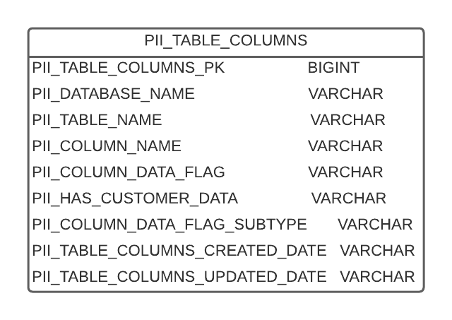

# Personal indentifiable information search

The subrep contains a T-SQL stored procedure for searching PII data given in input in a set of columns tables.
The columns tables to include in the search for data in input are extracted from the PII_TABLE_COLUMNS, that is structured as shown in the pic.

The stored procedure takes in input 3 parameters: name, email and phone. earch for corrispondences of the value is done independently on the input parameters.

