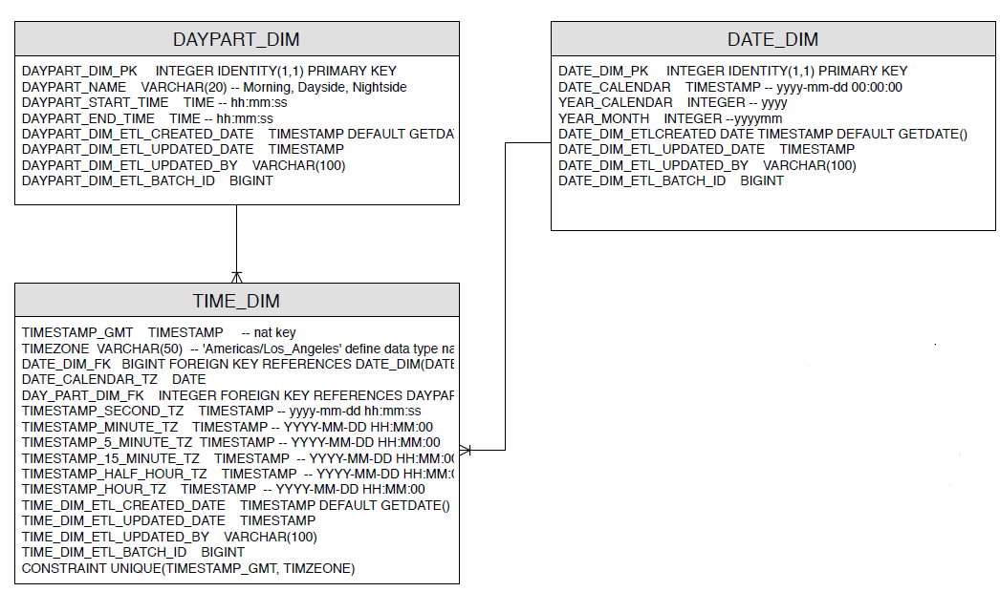

# Population of dimension tables for TIME, DATE and DAYPART

The subrep contains two stored procedure and a .sql insert script for populating dimension tables for TIME, DATE, WEEK and DAYPART. They are a part of a bigger data model inlcuding many additional dimension and fact tables.

The stored procedures are written in plpgsql to populate tables created in PostgreSQL database (version > 9).

## Tables structure

